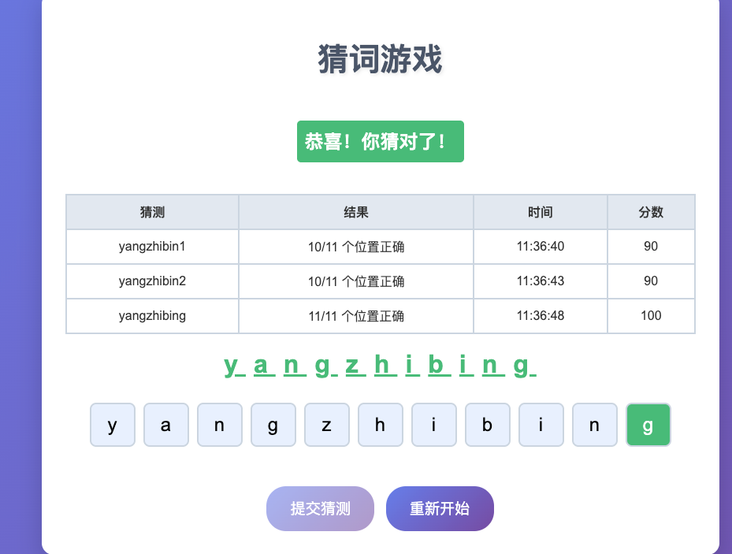
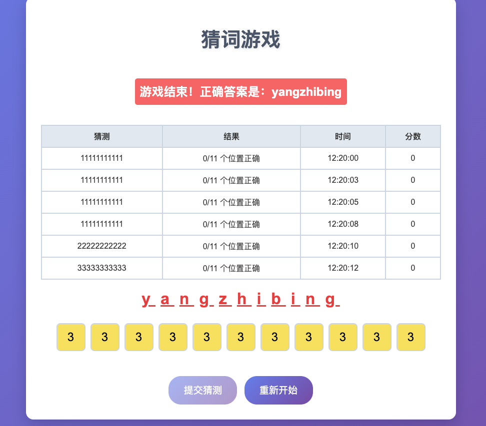

# Learning Notes 

## This learning notes is about the Fastapi Learning Manual（author: Bill）.

There is a game example in the Fastapi Learning Manual.
You can visit the game example by `http://localhost:8000/game`, and then you can play the game.

## The following is the screenshot of the game.

 

## How to play the game?
1) run `pip install -r requirements.txt` to install the dependencies.
2) Make sure you have installed the dependencies.
3) cd to `src` directory.(very important)
4) run the fastapi application by `uvicorn main:app --reload`.
5) Open the game example by `http://localhost:8000/game`.
6) You can play the game 6 times, then the game will end.
7) Enjoy the game!